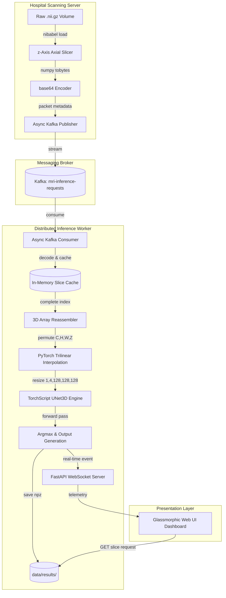

# Distributed High-Performance Inference Pipeline for Volumetric 3D Medical Segmentation

This repository implements a production-grade, distributed volumetric inference pipeline designed to ingest, stream, process, and visualize multi-modal 3D MRI scans (T1, T1w/T1c, T2, FLAIR) for brain tumor segmentation.

The architecture combines **MONAI** medical image processing, **PyTorch 3D Convolutional Neural Networks**, **Apache Kafka** distributed message streams, **FastAPI** web handlers, **WebSockets** for real-time telemetry, and **Kubernetes** auto-scaling configs.

---

## 🏗️ Architecture Overview

The system operates as a distributed microservices pipeline structured for high data velocities, low-latency execution, and resilient horizontal scaling.



### Data Pipeline Stages:
1. **Volumetric Slicing**: The hospital scanning server (Producer) reads 3D/4D NIfTI volumes, slices them along the z-axis (axial plane), base64 encodes the binary byte arrays, wraps them in sequential packet metadata, and streams them asynchronously to Kafka.
2. **Concurrently Streamed Messaging**: Apache Kafka serves as the high-throughput message ingestion broker, isolating the scanners from the inference workers and guaranteeing packet delivery.
3. **Volumetric Reassembly**: FastAPI workers consume slices asynchronously, caching them in memory per `volume_id`. When all slices are collected, they are stacked back to reconstruct the raw 3D modality grid.
4. **Isotropic Voxel Resizing**: The reassembled tensor is permuted to channel-first format `(1, 4, H, W, Z)` and resized using PyTorch's native `F.interpolate` trilinear interpolation to the exact shapes expected by the neural network: `(1, 4, 128, 128, 128)`.
5. **JIT Compilation Inference**: The input tensor is fed to the compiled **TorchScript 3D U-Net** engine. The logits output is processed via `argmax` along the channel dimension to generate the final segmentation label map.
6. **Real-Time Visualization**: Throughout the processing steps, progress and logs are broadcasted to the frontend via WebSockets. The visualizer overlays the color-coded segmentation classes (edema, non-enhancing, enhancing tumor) on structural modalities with customizable opacity.

---

## 🛠️ System Requirements

- **Operating System**: Windows 10/11, Ubuntu 20.04+, or macOS.
- **Python**: version `3.10` or `3.11` (Python `3.13` is supported, but `3.11` is recommended for optimized CUDA wheel compatibility).
- **Docker**: Docker Desktop (or standalone docker-compose) to spin up the local Kafka broker.
- **Hardware (Optional)**: NVIDIA GPU with CUDA support for high-throughput training/inference acceleration.

---

## 🚀 Setup & Execution Guide

### 1. Installation
Clone the repository and install the dependencies from the `backend/` directory:
```bash
cd backend
pip install -r requirements.txt
```

### 2. Download and Validate the Dataset
Fetch and extract the Medical Segmentation Decathlon (MSD) Task01_BrainTumour dataset (7.09 GB):
```bash
python src/download_dataset.py --remove-archive
```

### 3. Launch the Local Kafka Broker Stack
Use Docker Compose to launch a single-node Apache Kafka broker and Zookeeper mapping ports `9092` and `2181`:
```bash
docker-compose up -d
```

### 4. Compile the 3D U-Net to TorchScript
Compile the PyTorch neural network to a language-agnostic production binary:
```bash
python -m src.export
```
This reads the local checkpoint `backend/deploy/unet_model.pt` (created during training) and JIT-compiles it, saving the serialized trace to `backend/deploy/model_trace.pt`.

### 5. Start the FastAPI Worker Engine
Run the worker server from the `backend/` directory:
```bash
python -m src.main
```
This loads the TorchScript engine and opens the web application at `http://localhost:8000`.

### 6. Stream Scan Simulation
To trigger scan streaming over Kafka:
- Run the command-line publisher:
  ```bash
  python -m src.producer
  ```
- Or click the **⚡ Simulate Hospital Scan Stream** button directly in the web UI dashboard at `http://localhost:8000`.

---

## ⚡ Production Optimizations

- **Automatic Mixed Precision (AMP)**: The training runner (`backend/src/train.py`) utilizes PyTorch's native `GradScaler` and `autocast` to execute training in FP16 on GPU. This reduces the VRAM footprint by up to 50% and speeds up training epochs with negligible loss in Dice score accuracy.
- **C++ JIT Compilation**: The model architecture is written to be 100% scriptable. By compiling the model via `torch.jit.script` to `model_trace.pt`, we eliminate all Python interpreter runtime overhead. This JIT binary can be loaded directly inside a C++ daemon (`torch::jit::load`) to serve high-throughput, low-latency concurrent requests.
- **Kafka-Lag-Driven Auto-Scaling**: The Kubernetes Horizontal Pod Autoscaler manifest (`backend/deploy/hpa.yaml`) monitors custom external metrics (`kafka_consumergroup_lag` collected via Prometheus Adapter or KEDA) in addition to CPU utilization. If the Kafka ingestion queue accumulates backlog (e.g. during heavy diagnostic workloads), the HPA automatically scales worker replicas up to 10 pods to clear lag, scaling back down to 2 replicas when idle.
